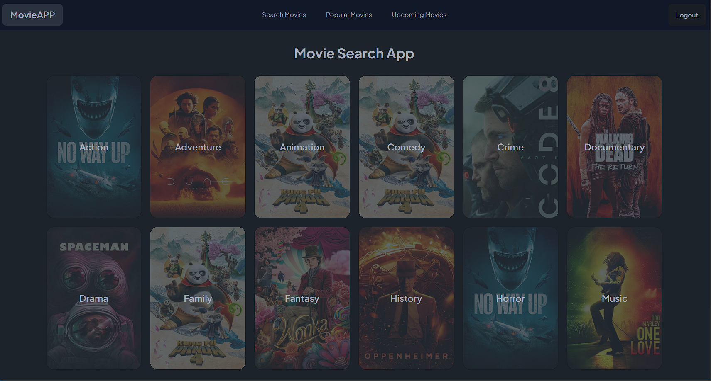
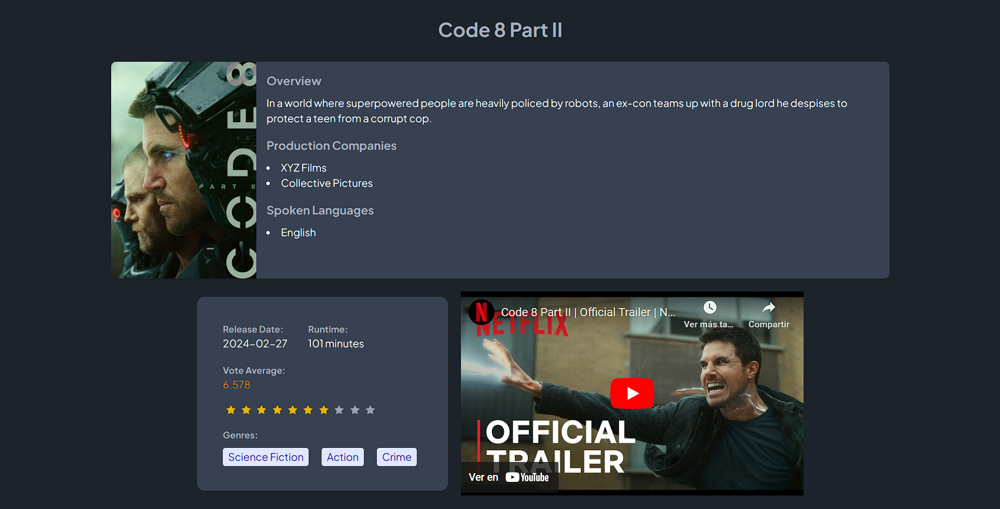

# Prueba BeMaster || App de peliculas



Pagina web donde podras ver en distintos apartados tus peliculas favoritas, hay diferentes secciones como: 

-Las mas populares

-Buscador de peliculas por su nombre	

-Peliculas que saldran pronto 

-Categorias	

Y en cada pelicula tendras distintos detalles de ella como:

-Sipnosis

-Los generos a los cuales pertenece la pelicula

-Su votacion y las estrellas que tiene

-Su fecha de salida

-Duracion dela pelicula

-Trailer el cual se puede ver desde la propia pagina




## Comenzando 🚀
_Estas instrucciones te permitirán obtener una copia del proyecto en funcionamiento en tu máquina local para propósitos de desarrollo y pruebas._

### Instalación 🔧

_Clona este repositorio en tu maquina local_

_Luego en tu terminal escribe:_

```
git clone https://github.com/CamiloProg/my-disney-plus-app.git
```
_Instala las dependencias necesarias_

```
cd my-disney-plus-app
npm i
npm run dev
```
## Ejecutando las pruebas ⚙️

Te podras registrar desde el boton "Register" bajo el formulario del Log in, o puedes entrar con la siguiente cuenta de prueba:

email: test@test.com
password: testtest

Aqui podras ver las categorias y elegir alguna, luego te redireccionara a todas las peliculas que hacen parte de esta categoria. Podras darle click a cualquiera y veras a continuacion todos sus detalles y video trailer de la misma.

En el navbar hay diferentes opciones, como un buscador de peliculas en el cual puedes poner el nombre de una pelicula, y el te filtrara las peliculas para encontrar todas las que tengan el nombre puesto. Tambien estan las peliculas populares, las peliculas que saldran pronto y por supuesto, un boton para salir de la cuenta ingresada.


## Construido con 🛠️
       
     


 ## Deploy 📈 
Aqui puedes probar la pagina desde una web ya creada
[Demo](https://camiloprog-pruebaswetro.netlify.app/)
